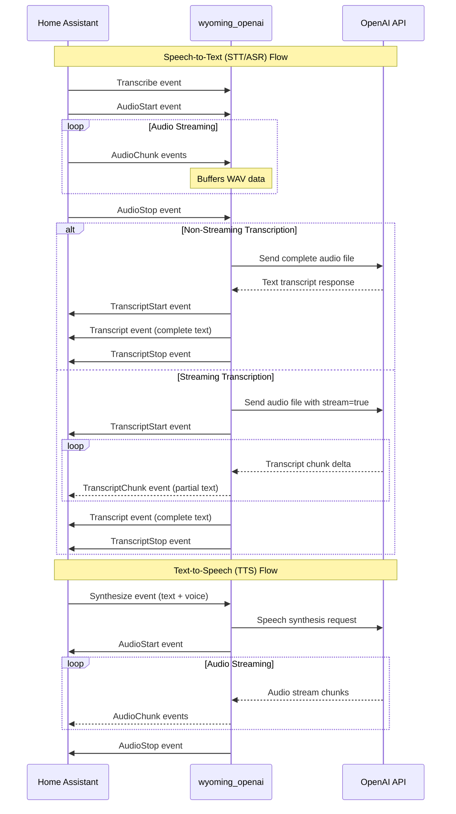

# Wyoming OpenAI

OpenAI-Compatible Proxy Middleware for the Wyoming Protocol

**Author:** Rory Eckel

Note: This project is not affiliated with OpenAI or the Wyoming project.

## Overview

This project introduces a [Wyoming](https://github.com/OHF-Voice/wyoming) server that connects to OpenAI-compatible endpoints of your choice. Like a proxy, it enables Wyoming clients such as the [Home Assistant Wyoming Integration](https://www.home-assistant.io/integrations/wyoming/) to use the transcription (Automatic Speech Recognition - ASR) and text-to-speech synthesis (TTS) capabilities of various OpenAI-compatible projects. By acting as a bridge between the Wyoming protocol and OpenAI, you can consolidate the resource usage on your server and extend the capabilities of Home Assistant.

## Featured Models

This project features a variety of examples for using cutting-edge models in both Speech-to-Text (STT) and Text-to-Speech (TTS) scenarios:

- **`gpt-4o-transcribe`**: OpenAI's latest and most advanced model for highly accurate speech recognition.
- **`gpt-4o-mini-tts`**: A compact and efficient text-to-speech model from OpenAI, perfect for responsive vocalization.
- **`kokoro`**: A high-quality, open-source text-to-speech model, available for local deployment via [Speaches](#2-deploying-with-speaches-local-service) and [Kokoro-FastAPI](#3-deploying-with-kokoro-fastapi-and-speaches-local-services).
- **`piper`**: Fast, local neural text-to-speech system with multiple high-quality voices, available for local deployment via [LocalAI](#3-deploying-with-localai-local-service).
- **`whisper`**: The original renowned open-source transcription model from OpenAI, widely used for its accuracy and versatility.
## Objectives

1. **Wyoming Server, OpenAI-compatible Client**: Function as an intermediary between the Wyoming protocol and OpenAI's ASR and TTS services.
2. **Service Consolidation**: Allow users of various programs to run inference on a single server without needing separate instances for each service.
Example: Sharing TTS/STT services between [Open WebUI](#open-webui) and [Home Assistant](#usage-in-home-assistant).
3. **Asynchronous Processing**: Enable efficient handling of multiple requests by supporting asynchronous processing of audio streams.
4. **Simple Setup with Docker**: Provide a straightforward deployment process using [Docker and Docker Compose](#docker-recommended) for OpenAI and various popular open source projects.

## Terminology

- **TTS (Text-to-Speech)**: The process of converting text into audible speech output.
- **ASR (Automatic Speech Recognition) / STT (Speech-to-Text)**: Technologies that convert spoken language into written text. ASR and STT are often used interchangeably to describe this function.

## Installation (Local Development)

### Prerequisites

- Tested with Python 3.12
- Optional: OpenAI API key(s) if using proprietary models

### Instructions

1. **Clone the Repository**

   ```bash
   git clone https://github.com/roryeckel/wyoming-openai.git
   cd wyoming-openai
   ```

2. **Create a Virtual Environment** (optional but recommended)

   ```bash
   python3 -m venv venv
   source venv/bin/activate  # On Windows use `venv\Scripts\activate`
   ```

3. **Install as a Development Package**

    ```bash
    pip install -e .
    ```
    Assuming you have activated a virtual environment, the wyoming_openai package will be installed into it. This will build and install the package in editable mode, allowing you to make changes to the code without needing to reinstall it each time.

    Or, if you prefer to install it as a regular (production) package:

    ```bash
    pip install .
    ```

    This is more suitable for a global installation.

4. **Configure Environment Variables or Command Line Arguments**

## Installation from PyPI

Since v0.3.2, `wyoming-openai` is now available on [PyPI](https://pypi.org/project/wyoming-openai/). To install the latest release, run:

```bash
pip install wyoming-openai
```

This is useful for local deployment when you don't want to clone the repository or if you want to use the library components in your own projects.

To upgrade to the latest version, run:

```bash
pip install --upgrade wyoming-openai
```

## Command Line Arguments

The proxy server can be configured using several command line arguments to tailor its behavior to your specific needs.

### Example Usage

Assuming you have installed the package in your current environment, you can run the server with the following command:

```bash
python -m wyoming_openai \
  --uri tcp://0.0.0.0:10300 \
  --log-level INFO \
  --languages en \
  --stt-openai-key YOUR_STT_API_KEY_HERE \
  --stt-openai-url https://api.openai.com/v1 \
  --stt-models whisper-1 \
  --stt-streaming-models gpt-4o-transcribe gpt-4o-mini-transcribe \
  --stt-backend OPENAI \
  --tts-openai-key YOUR_TTS_API_KEY_HERE \
  --tts-openai-url https://api.openai.com/v1 \
  --tts-models gpt-4o-mini-tts tts-1-hd tts-1 \
  --tts-voices alloy ash coral echo fable onyx nova sage shimmer \
  --tts-backend OPENAI \
  --tts-speed 1.0
```

## Configuration Options

In addition to using command-line arguments, you can configure the Wyoming OpenAI proxy server via environment variables. This is especially useful for containerized deployments.

### Table of Environment & Command Line Options

| **Command Line Argument**               | **Environment Variable**                   | **Default Value**                           | **Description**                                                      |
|-----------------------------------------|--------------------------------------------|-----------------------------------------------|----------------------------------------------------------------------|
| `--uri`                                 | `WYOMING_URI`                              | tcp://0.0.0.0:10300                           | The URI for the Wyoming server to bind to.                           |
| `--log-level`                           | `WYOMING_LOG_LEVEL`                        | INFO                                          | Sets the logging level (e.g., INFO, DEBUG).                          |
| `--languages`                           | `WYOMING_LANGUAGES`                        | en                                            | Space-separated list of supported languages to advertise.            |
| `--stt-openai-key`                      | `STT_OPENAI_KEY`                           | None                                          | Optional API key for OpenAI-compatible speech-to-text services.      |
| `--stt-openai-url`                      | `STT_OPENAI_URL`                           | https://api.openai.com/v1                     | The base URL for the OpenAI-compatible speech-to-text API            |
| `--stt-models`                          | `STT_MODELS`                               | None (required*)                                          | Space-separated list of models to use for the STT service. Example: `gpt-4o-transcribe gpt-4o-mini-transcribe whisper-1` |
| `--stt-streaming-models`                | `STT_STREAMING_MODELS`                     | None                                          | Space-separated list of STT models that support streaming (e.g. `gpt-4o-transcribe gpt-4o-mini-transcribe`). Only these models will use streaming mode. |
| `--stt-backend`                         | `STT_BACKEND`                              | None (autodetected)                           | Enable unofficial API feature sets.          |
| `--stt-temperature`                     | `STT_TEMPERATURE`                          | None (autodetected)                           | Sampling temperature for speech-to-text (ranges from 0.0 to 1.0)               |
| `--stt-prompt`                          | `STT_PROMPT`                               | None                                          | Optional prompt for STT requests (Text to guide the model's style).   |
| `--tts-openai-key`                      | `TTS_OPENAI_KEY`                           | None                                          | Optional API key for OpenAI-compatible text-to-speech services.      |
| `--tts-openai-url`                      | `TTS_OPENAI_URL`                           | https://api.openai.com/v1                     | The base URL for the OpenAI-compatible text-to-speech API            |
| `--tts-models`                          | `TTS_MODELS`                               | None (required*)                           | Space-separated list of models to use for the TTS service. Example: `gpt-4o-mini-tts tts-1-hd tts-1` |
| `--tts-voices`                          | `TTS_VOICES`                               | Empty (autodetected)                          | Space-separated list of voices for TTS.        |
| `--tts-backend`                         | `TTS_BACKEND`                              | None (autodetected)                           | Enable unofficial API feature sets.          |
| `--tts-speed`                           | `TTS_SPEED`                                | None (autodetected)                           | Speed of the TTS output (ranges from 0.25 to 4.0).               |
| `--tts-instructions`                    | `TTS_INSTRUCTIONS`                         | None                                          | Optional instructions for TTS requests (Control the voice).    |

## Docker (Recommended)

### Prerequisites

- Ensure you have [Docker](https://www.docker.com/products/docker-desktop) and [Docker Compose](https://docs.docker.com/compose/install/) installed on your system.

### Deployment Options

You can deploy the Wyoming OpenAI proxy server in different environments depending on whether you are using official OpenAI services or a local alternative like Speaches. You can even run multiple wyoming_openai instances on different ports for different purposes. Below are example scenarios:

#### 1. Deploying with Official OpenAI Services

To set up the Wyoming OpenAI proxy to work with official OpenAI APIs, follow these steps:

- **Environment Variables**: Create a `.env` file in your project directory that includes necessary environment variables such as `STT_OPENAI_KEY`, `TTS_OPENAI_KEY`.

- **Docker Compose Configuration**: Use the provided `docker-compose.yml` template. This setup binds a Wyoming server to port 10300 and uses environment variables for OpenAI URLs, model configurations, and voices as specified in the compose file.

- **Command**:
  
  ```bash
  docker compose -f docker-compose.yml up -d
  ```

#### 2. Deploying with Speaches Local Service

If you prefer using a local service like Speaches instead of official OpenAI services, follow these instructions:

- **Docker Compose Configuration**: Use the `docker-compose.speaches.yml` template which includes configuration for both the Wyoming OpenAI proxy and the Speaches service.

- **Speaches Setup**:
  - The Speaches container is configured with specific model settings (`Systran/faster-distil-whisper-large-v3` for STT and `speaches-ai/Kokoro-82M-v1.0-ONNX` for TTS).
  - It uses a local port (8000) to expose the Speaches service.
  - NVIDIA GPU support is enabled, so ensure your system has an appropriate setup if you plan to utilize GPU resources.
  - Note: wyoming_openai disables Speaches VAD (Voice Activity Detection) by default, as it is not yet compatible with the Wyoming protocol.

- **Command**:
  
  ```bash
  docker compose -f docker-compose.speaches.yml up -d
  ```

#### 3. Deploying with LocalAI Local Service

LocalAI is a drop-in replacement for OpenAI API that runs completely locally, supporting both Whisper (STT) and Piper (TTS). This setup provides excellent privacy and performance without requiring external API keys.

- **LocalAI Setup**:
  - The provided example compose uses LocalAI's GPU-accelerated image with NVIDIA CUDA 12 support, but you can adjust things as needed.
  - Automatically downloads `whisper-base` model and multiple Piper TTS voices on first run
  - Provides OpenAI-compatible endpoints for seamless integration
  - No API keys required since everything runs locally
  - Includes automatic model initialization via dedicated init container

- **Docker Compose Configuration**: Use the `docker-compose.localai.yml` template which includes configuration for both the Wyoming OpenAI proxy and LocalAI service.

- **Command**:

  ```bash
  docker compose -f docker-compose.localai.yml up -d
  ```

#### 4. Deploying with Kokoro-FastAPI and Speaches Local Services

For users preferring a setup that leverages Kokoro-FastAPI for TTS and Speaches for STT, follow these instructions:

- **Docker Compose Configuration**: Use the `docker-compose.kokoro-fastapi.yml` template which includes configuration for both the Wyoming OpenAI proxy and Kokoro-FastAPI TTS service (Kokoro).

- **Speaches Setup**:
  - Use it in combination with the Speaches container for access to STT.

- **Kokoro Setup**:
  - The Kokoro-FastAPI container provides TTS capabilities.
  - It uses a local port (8880) to expose the Kokoro service.
  - NVIDIA GPU support is enabled, so ensure your system has an appropriate setup if you plan to utilize GPU resources.

- **Command**:

  ```bash
  docker compose -f docker-compose.speaches.yml -f docker-compose.kokoro-fastapi.yml up -d
  ```

#### 5. Development with Docker

If you are developing the Wyoming OpenAI proxy server and want to build it from source, use the `docker-compose.dev.yml` file along with the base configuration.

- **Command**:
  
  ```bash
  docker compose -f docker-compose.yml -f docker-compose.dev.yml up -d --build
  ```

#### 6. Example: Development with Additional Local Service

For a development setup using the Speaches local service, combine `docker-compose.speaches.yml` and `docker-compose.dev.yml`. This also works for `docker-compose.kokoro-fastapi.yml` and `docker-compose.localai.yml`.

- **Command**:
  
  ```bash
  docker compose -f docker-compose.speaches.yml -f docker-compose.dev.yml up -d --build
  ```

#### 7. Docker Tags

We follow specific tagging conventions for our Docker images. These tags help in identifying the version and branch of the code that a particular Docker image is based on.

- **`latest`**: This tag always points to the latest stable release of the Wyoming OpenAI proxy server. It is recommended for users who want to run the most recent, well-tested version without worrying about specific versions.

- **`main`**: This tag points to the latest commit on the main code branch. It is suitable for users who want to experiment with the most up-to-date features and changes, but may include unstable or experimental code.

- **`major.minor.patch version`**: Specific version tags (e.g., `0.3.4`) correspond to specific stable releases of the Wyoming OpenAI proxy server. These tags are ideal for users who need a consistent, reproducible environment and want to avoid breaking changes introduced in newer versions.

- **`major.minor version`**: Tags that follow the `major.minor` format (e.g., `0.3`) represent a range of patch-level updates within the same minor version series. These tags are useful for users who want to stay updated with bug fixes and minor improvements without upgrading to a new major or minor version.

### General Deployment Steps

1. **Start Services**: Run the appropriate Docker Compose command based on your deployment option.
2. **Verify Deployment**: Ensure that all services are running by checking the logs with `docker compose logs -f` or accessing the Wyoming OpenAI proxy through its exposed port (e.g., 10300) to ensure it responds as expected.
3. **Configuration Changes**: You can modify environment variables in the `.env` file or directly within your Docker Compose configuration files to adjust settings such as languages, models, and voices without rebuilding containers.

## Usage in Home Assistant

1. Install & set up your Wyoming OpenAI instance using one of the [deployment options](#deployment-options) above.
2. In HA, Go to Settings, Devices & Services, Add Integration, and search for Wyoming Protocol. Add the Wyoming Protocol integration with the URI of your Wyoming OpenAI instance.
3. The hard part is over! Configure your Voice Assistant pipeline to use the STT/TTS services provided by your new Wyoming OpenAI instance.

#### Reloading Configuration Changes in Home Assistant

When you make changes to your configuration such as updating models, voices, or URLs, it's important to reload the Wyoming OpenAI integration in Home Assistant to apply these changes. Here's how to do it:

1. Go to **Settings** > **Devices & Services**
2. Find and select your **Wyoming OpenAI** integration
3. Click on **Reload**

### Sequence Diagrams

#### Home Assistant

Home Assistant uses the Wyoming Protocol integration to communicate with the Wyoming OpenAI proxy server. The proxy server then communicates with the OpenAI API to perform the requested ASR or TTS tasks. The results are then sent back to Home Assistant.



#### Open WebUI

No proxy is needed for Open WebUI, because it has native support for OpenAI-compatible endpoints.


## Future Plans (Descending Priority)

- Improved streaming support directly to OpenAI APIs
- Reverse direction support (Server for OpenAI compatible endpoints - possibly FastAPI)
- OpenAI Realtime API

## Contributing

Contributions are welcome! Please feel free to open issues or submit pull requests. For major changes, please first discuss the proposed changes in an issue.

## Quality Assurance

### Linting (Ruff)

This project uses [Ruff](https://github.com/astral-sh/ruff) for linting and code quality checks. Ruff is a fast Python linter written in Rust that can replace multiple tools like flake8, isort, and more.

To use Ruff during development:

1. Install development dependencies:
   ```bash
   pip install -e ".[dev]"
   ```

2. Run Ruff to check your code:
   ```bash
   ruff check .
   ```

A GitHub Action automatically runs Ruff on all pull requests and branch pushes to ensure code quality.

### Testing (Pytest)

This project uses [pytest](https://pytest.org/) for unit testing. Tests are located in the [`tests/`](tests/) directory and cover core modules such as compatibility, constants, handlers, initialization, and utilities.

To run the tests:

1. Install development dependencies (if not already done):
    ```bash
    pip install -e ".[dev]"
    ```

2. In the [`tests/`](tests/) folder, run all tests with:
    ```bash
    pytest
    ```

All new code should include appropriate tests.
A GitHub Action automatically runs pytest on all pull requests and branch pushes to ensure tests pass.

